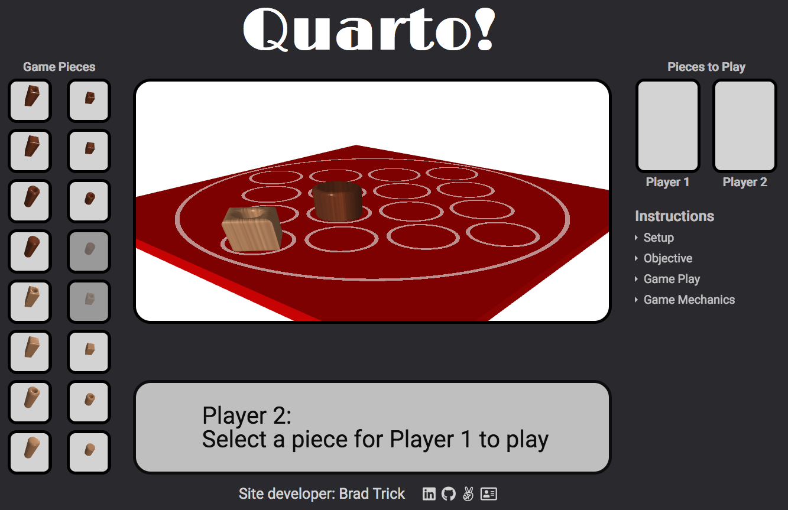
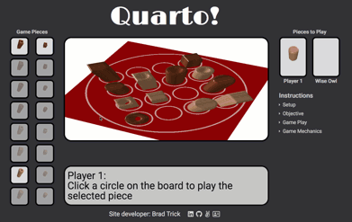
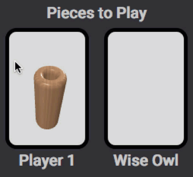
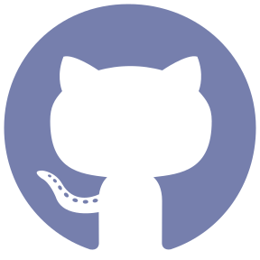

# <p align="center"></p>  



Designed by Swiss mathematician Blaise Müller, Quarto is a challenging logic game for two players. This version is built using vanilla javascript and the threejs library.
# <p align="center"> [Check Out the Live App!][1] </p>

## Overview  
Game components consist of a board and 16 playing pieces. Each piece has four attributes: 

        1. size (tall or short)  
        2. shape (square or circular)  
        3. color (dark or light)  
        4. solidity (hollow or solid)  

The game begins with an empty board. Play proceeds with the two players alternately placing pieces on the board, trying to construct a row/column/diagonal of four pieces with at least one shared attribute (e.g., all tall). The catch? The piece each player must place on the board is chosen by their opponent.  
  
## Game Play
Play begins with Player 2 selecting a piece for Player 1 to place. Once selected, the piece will appear in Player 1's Pieces to Play window. Player 1 then plays the piece by clicking a circle on the board. Player 1 next selects a piece for Player 2. Play continues in this fashion until one player forms a winning row/col/diag of 4 pieces or all the pieces have been played.

## AI Modes
The game has two AI modes, Panda and Wise Owl. Panda is a novice player who chooses pieces and selects board spots randomly. Wise Owl plays a much smarter game, always making a winning move when available and never selecting a piece that would enable a human opponent to win if it can be avoided.

## Graphics
Players may rotate the board to get a better view by clicking on the board and moving the mouse:



Players may also move the pieces in the Pieces to Play windows:



The circles on the board are created by writing a custom fragment shader in GLSL that calculates the color of each fragment by transforming the fragment's position to a Quadrant I unit square and determining where it falls relative to the radius of the desired circle: 
```
    void main() {
        vec2 pos = abs(vUv.xy);
        if (pos.x >= 1.0) pos.x -= 1.0;
        if (pos.y >= 1.0) pos.y -= 1.0;

        float d = distance(pos, vec2 (0, 0));
        if ( d < radius) {
            if (fill) gl_FragColor = vec4(innerColor, 1.0);
            else discard;
        }
        else if (d < radius + strokeWidth) gl_FragColor = vec4(borderColor, 1.0);
        else discard;
    }
```

The Game Pieces pool is implemented by laying an unordered list with 16 list elements over a single canvas. Each piece appears in its own scene, which is then mapped to and displayed on the portion of the canvas under the corresponding li. The calculations for determining the location on the canvas for each piece/scene is as follows: 
```js 
    const ul = document.getElementById("piece-pool");
    const ulRect = ul.getBoundingClientRect();
    const li = scene.userData.li;
    const index = li.dataset.idx;
    const rect = li.getBoundingClientRect();
    const left = rect.left - ulRect.left + li.clientLeft;
    const width = li.clientWidth;
    const height = li.clientHeight;
    const margin = getComputedStyle(li);
    const offsetRowHeight = (li.offsetHeight+parseInt(margin.marginTop)+parseInt(margin.marginBottom)) * (1+Math.floor(index/2));
    const bottom = this.renderer.domElement.height - offsetRowHeight + parseInt(margin.marginBottom) + li.clientTop;
    
    this.renderer.setScissor(left, bottom, width, height);
    this.renderer.setViewport(left, bottom, width, height);
    this.camera.aspect = width/height;
    this.camera.updateProjectionMatrix();
    this.controls.update();
    this.renderer.render( scene, this.camera );

```

## Developer
###  **Brad Trick** [][2] [][3] [][4] [][5]  
 
[1]: https://brtrick.github.io/Quarto/
[2]: https://www.linkedin.com/in/bradley-trick/
[3]: https://github.com/brtrick
[4]: https://angel.co/u/bradley-trick
[5]: https://www.github.io/brtrick/